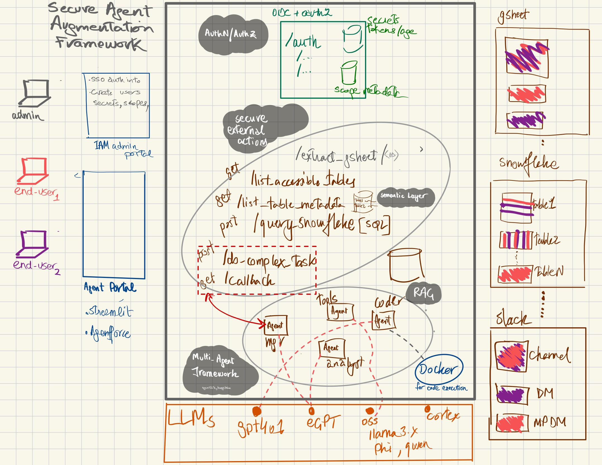

# Secure Agent Augmentation

**Secure Agent Augmentation** is a scalable, secure framework for AI agents to interact with external systems, perform complex multi-agent workflows, and manage asynchronous operations. Built with production-grade technologies like FastAPI, and using OAuth 2.0 for robust security, the goal for this framework is to provide developers intending to enhance their AI agent capabilities beyond POCs and laptops and into productions. The goal to to make AI deployments safer, more capable, and fully accessible in hosted environments.

**Architecture**


The framework is expected to be deployed in a run-time environment, and includes
- **AuthN/AuthZ** Implements OAuth 2.0 for user authentication and authorization, with granular scopes for controlling access to specific actions and data for calling agents
- **Secure External Actions** wrapped up in fully contained APIs, which double as libraries for agents executing locally in the runtime.
    - **RAG**: To support API data which can bust the input context of LLMs, chunking and vectorization for that data will be supported
    - **Semantic Layer**: For external actions which call data warehouses, a semantic layer (in the form of locally stored yaml/json) for each useful field within database table is stored
        - Along with helpful metadata on each useful field in a table, some hints on what type of data can be served from them along with helpful SQL examples also stored in this semantic layer.
        - this metadata will be available through an API fetch (remotely) or an SQL query (locally). 
        - This is _super_ helpful in enriching the prompts for locally running agents or agents which are calling these APIs from outside.
        - By this enrichment, the agents can craft smart SQL queries to extract the requested data.
- **Multi-Agent-Framework** which supports complex workflows involving multiple AI agents that can operate asynchronously, leveraging callbacks to notify of completed tasks. 
    - a popular multi-agent framework *(tbd)* will also be deployed as part of this solution.
    - The beauty of this approach is that the code powering the external actions (tools) APIs are also locally powering these local agents as imported function calls.
- **LLM abstraction**:  LLMs are **not** hosted as part of this framework, and are called by the MAF through API calls. This allows for 

## Infrastructure tenets

- **Container-First**: Consistent, scalable, and portable application deployment across diverse environments, enhancing agility and resource efficiency.
- **Scalable Production-Grade API**: Utilizes FastAPI for rapid, yet scalable, deployment. Easily integrates into containerized environments (e.g., Docker, Kubernetes).
- **Hosted Cloud-Ready Architecture**: Built to be deployed on popular hosting solutions instead of running on your laptop like most open-source solutions.
- **OpenAPI support**: Supports the OpenAPI spec out of the box which allows both humans and computers to understand and interact with the API’s functionalities without having access to the underlying codebase.

## Why Secure Agent Augmentation?

I see the need for this framework because all common and new agent framework project are written without consideration of security and scalability mind. These frameworks work great on laptops or as POCs, but can't be easily enhanced for production-grade deployment.

**Secure Agent Augmentation** represents a secure, versatile framework for enhancing the capabilities of AI agents through providing a safe, authenticated and scalable runtime execution for external actions, and in the future, executing multi-agent framework tasks. 

## Directory Structure
```
project_root/
├─ .env                             # Env vars ; in .gitignore
├─ requirements.txt                 # Python dependencies
├─ docker/                          # Docker related configs and Compose
│  ├─ Dockerfile.api_server         # Dockerfile for API server container
│  ├─ Dockerfile.admin_app          # Dockerfile for Admin app container
│  ├─ docker-compose.yml            # Orchestration file
├─ src/
│  ├─ api_server/                   # Flask-based OAuth2 server + resource endpoints
│  │  ├─ __init__.py                # Makes api_server a package
│  │  ├─ main.py                   # Entry point for Flask app
│  │  ├─ config.py                 # Env detection, DB URLs, token expiry
│  │  ├─ database.py               # Sync SQLAlchemy setup
│  │  ├─ models.py                 # DB models
│  │  ├─ schemas.py                # Pydantic-like schemas (optional) or dataclasses
│  │  ├─ security.py               # Authlib OAuth2 integration, JWT logic
│  │  ├─ utils.py                  # Utilities
│  │  ├─ constants.py              # Available scopes
│  │  ├─ oauth2_implementation.py  # Flask blueprint with /token, /introspect, /revoke, /jwks
│  │  ├─ logging_conf.py           # Logging configuration
│  │  ├─ templates/
│  │  │  ├─ admin_gui.html
│  │  ├─ admin/
│  │  │  ├─ api/
│  │  |  │  ├─ endpoints.py     # Flask-based admin API (password protected)
│  │  |  └─ gui/
│  │  |     ├─ endpoints.py     # Flask-based GUI (password protected)
│  │  └─ routers/                  # Resource endpoints as separate blueprints
│  │     ├─ auth_testing/
│  │     │  ├─ endpoints.py
│  │     ├─ release_oversight/          # wip
│  │     │  ├─ endpoints.py
│  │     ├─ service_ticket_analysis/    # wip
│  │     │  ├─ endpoints.py
│  │     ├─ tableau_dashboard_usage/    # wip
│  │     │  ├─ endpoints.py
│  │     ├─ internal_audit_analysis/    # wip
│  │     │  ├─ endpoints.py
│  │     ├─ slack_analysis/             # wip
│  │     │  ├─ endpoints.py
│  │     ├─ common_actions/             # wip
│  │     │  ├─ endpoints.py
│  ├─ oauth_client/
│  │  ├─ client.py
│  ├─ common/
│  │  ├─ utils.py
│  ├─ python_notebooks/
│  │  ├─ admin_and_client_demo.ipynb    # Notebook demonstrating usage
└─ README.md
```


## Setup

1. [Install](https://www.python.org/downloads/) Python on your computer. *Recommended versions are 3.9.x through 3.11.x, Some snowflake libraries balk with 3.12*

2. [Install](https://docs.docker.com/desktop/) Docker on your computer, and postgresDB as well.

3. **Clone** the Repository: `git clone https://github.com/knail2/secure-agent-augmentation.git`

4. **Switch** into the directory: `cd secure-agent-framework`
5. Create a **virtual environment**: `python -m venv venv`
We do this so that the libraries are safely installed for the context of this project, and don't mess with potentially the same libraries installed globally on your machine. We use the python [virtual environment](https://docs.python.org/3/library/venv.html) concept.
6. **Activate** the virtual environment: `. ./venv/bin/activate`.
It should show venv in the cli prompt, e.g. `(venv) tcm secure-agent-augmentation$ `
7. Install required **libraries** into this env: `pip install -r requirements.txt`
8. **Create Public and Private keys**
We will upload the private key into the auth server, and that dude will be using the private key to sign the (JWT) tokens that it will be issuing to the clients, which the clients could use to verify the authenticity of the tokens. (this is an added layer of security provided by the oauth2.0 RFC that we are implementing here)
    - For LOCAL:
        - Create a private/public key. See [creating keys for JWT signing](docs/Creating_Keys_For_JWT_Signing.md)

        - Place those (JWT) private/public keys in:
     - `~/.ssh/jwt_private_key.pem`
     - `~/.ssh/jwt_public_key.pem`

    -  For hosted environments like AWS, HEROKU or SNOWFLAKE:
        - Put these keys in environment variables:
            - `JWT_PRIVATE_KEY`
            - `JWT_PUBLIC_KEY`
    directly in [AWS](https://docs.aws.amazon.com/AmazonECS/latest/developerguide/taskdef-envfiles.html), [Heroku](https://devcenter.heroku.com/articles/config-vars) or [Snowflake](https://docs.snowflake.com/developer-guide/snowpark-container-services/additional-considerations-services-jobs?utm_cta=website-webinars-vhol-feature).

9. Set up local environments using this `.env`  example:
(I don't upload .env to github obviously! see my .gitignore)
ENVIRONMENT=local
POSTGRES_USER=local_user
POSTGRES_PASSWORD=local_password
POSTGRES_DB=local_db
POSTGRES_HOST=localhost
POSTGRES_PORT=5432
TOKEN_EXPIRY_SECONDS=3600

10. Run the server (locally)
``uvicorn src.api_server.main:app –reload``


12. Set up database and local user, just run `run.sh`
the script attempts to log into the local postgres db (you may need to provide admin creds), and checks to see if user/password and db exist, and if not, then it creates them, and binds the user to the db, and starts the app.


12. (for localhost testing only) Run Jupyter Lab: `jupyter lab` and fire up `notebooks/admin_and_client_demo.ipynb` to test the various APIs in this run-time framework.


## :construction: Running the server on Docker 

## :construction: Deploying on Heroku

- the main branch has Procfile which deploys the api_server code to the heroku repo

## :construction: Security Guidelines
*I need to flesh this out with a standard approach on how scopes can be used for external AI actions. There are no standards defined on the internet, so I'll have to come up with some abstractions myself. Stay tuned*

- **OAuth 2.0 Scopes**: Fine-tune access control by assigning different scopes to each API endpoint.
- **Secure Defaults**: All actions require an OAuth token for access.


### :construction: Example Usage (WIP)

*All the stuff in this section is in construction, the info below is random GPT generated stuff, it doesn't work.
I'll come back and fix it up*

- **Register an Action**: Create AI agent actions accessible via REST endpoints.
- **Control Access with OAuth 2.0 Scopes**: Limit who can call actions, and what data they have access to, using fine-grained scopes.
- **Multi-Agent Asynchronous Workflow**: Trigger a complex action that involves multiple agents working together, asynchronously.

#### :construction: Creating authenticated API Endpoints (WIP)

To create a simple authenticated AI action, add a new endpoint:

```python
from fastapi import APIRouter, Depends
from app.security import oauth2_scheme

router = APIRouter()

@router.get("/run-action", tags=["actions"])
async def run_action(token: str = Depends(oauth2_scheme)):
    # Logic for the AI agent action
    return {"message": "Action executed successfully."}
```

#### :construction: Multi-Agent Asynchronous Workflow Example (WIP)

Here is an example of triggering an asynchronous multi-agent workflow:

```python
from fastapi import APIRouter, Depends
from app.security import oauth2_scheme
import asyncio

router = APIRouter()

@router.post("/trigger-async-workflow", tags=["workflows"])
async def trigger_async_workflow(token: str = Depends(oauth2_scheme)):
    # Start an async workflow involving multiple agents
    task = asyncio.create_task(async_workflow())
    return {"message": "Workflow triggered successfully, you will be notified upon completion."}

async def async_workflow():
    # Simulate a complex, multi-agent workflow
    await asyncio.sleep(5)  # Simulate work being done asynchronously
    # Logic to post results to a callback endpoint or update status
    print("Workflow completed, posting results.")
```


## Contributing

1. Fork the repository.
2. Create a new feature branch (`git checkout -b feature-name`).
3. Commit your changes (`git commit -m 'Add feature'`).
4. Push to the branch (`git push origin feature-name`).
5. Create a Pull Request.

- Create clients using the admin UI or admin API. The `client_id` and `client_secret` generated can be used by another system (the OAuth2 client) to request tokens.

## JWT Keys and Deployment

- **Local**: Keys in `~/.ssh/`
- **Heroku/Snowflake**: Keys in environment variables `JWT_PRIVATE_KEY` and `JWT_PUBLIC_KEY`.

Ensure keys are properly generated as shown above and stored securely. On production environments like Heroku or Snowflake, never commit keys to source control; only set them via environment variables.

## Additional Notes

- The code is environment-agnostic: it detects `ENVIRONMENT` and configures database and JWT keys accordingly.
- `DATABASE_URL` is used for Heroku Postgres.
- For Snowflake, all required Snowflake credentials must be in environment variables.
- The resource endpoints (`/protected`, `/protected_post`, `/highly_confidential`, etc.) rely on scopes included in the JWT `scope` claim. The token issuing process (via `/token` endpoint) must include appropriate scopes. The admin can configure clients with the desired scopes.

## License
[MIT](LICENSE)

## Contact
Feel free to open an issue or pull request if you encounter any problems or have a feature request.

Thanks!
Omer.
